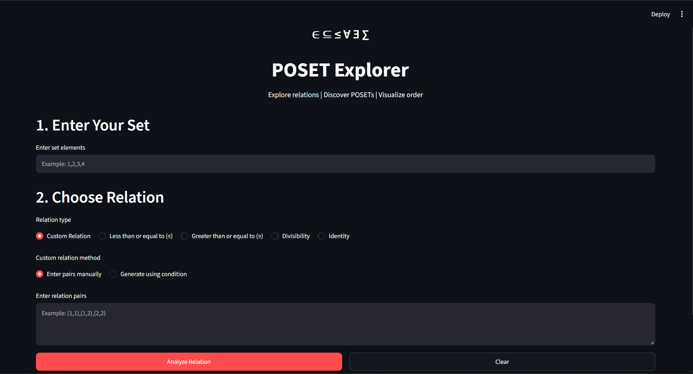
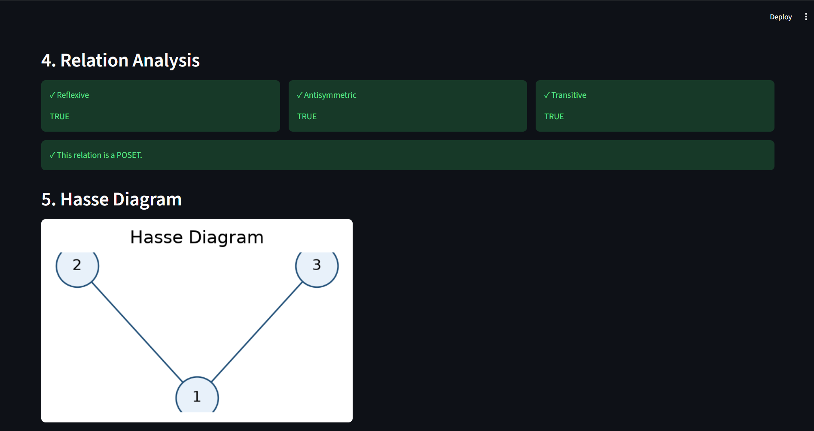
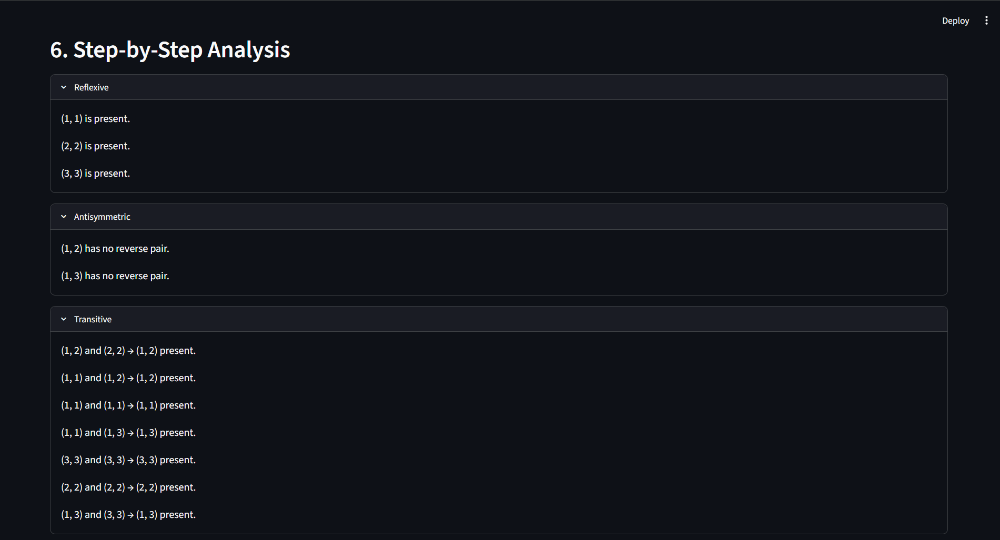

# POSET Explorer

### Explore Relations • Discover POSETs • Visualize Order

POSET Explorer is an interactive Discrete Mathematics application that helps users create and analyze relations and understand Partially Ordered Sets (POSETs) through Hasse diagrams.

## 📌 About the Project

This project provides an easy and interactive way to work with relations on finite sets.

The application can:
- Create relations using different methods
- Check important POSET properties
- Determine whether a relation is a POSET
- Generate Hasse diagrams for POSETs
- Show step-by-step analysis of relation properties

## ✨ Features

- Enter a custom finite set
- Create custom relations using ordered pairs
- Generate relations using mathematical conditions
- Built-in relations:
  - Less than or equal to (≤)
  - Greater than or equal to (≥)
  - Divisibility
  - Identity
- Check:
  - Reflexive property
  - Antisymmetric property
  - Transitive property
- Automatically identify POSETs
- Generate Hasse diagrams
- Display cover relations
- Step-by-step property analysis

## 🛠️ Technologies Used

- Python
- Streamlit
- NetworkX
- Matplotlib
- Python AST

## 📂 Project Structure

POSET-Explorer/
│
├── app.py
├── parser.py
├── poset_checker.py
├── hasse_diagram.py
├── relation_generators.py
├── examples.py
├── requirements.txt
└── README.md

## 📸 Screenshots

